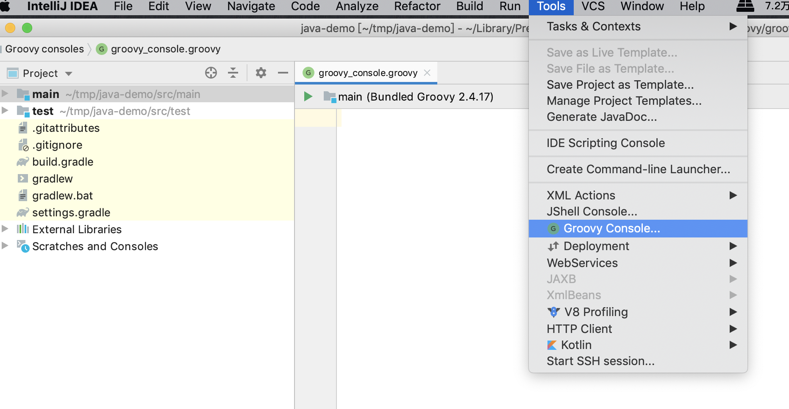
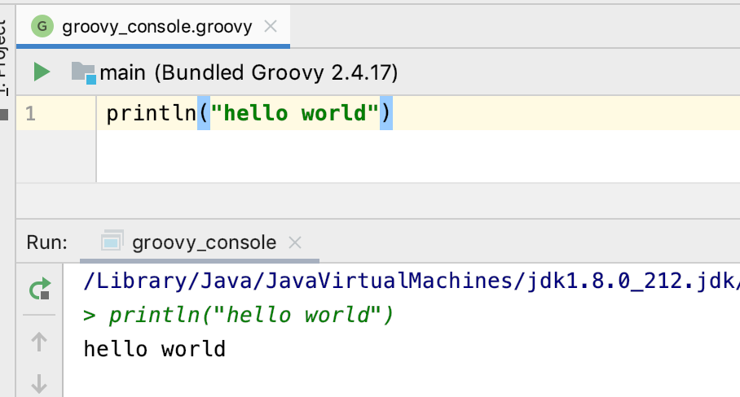
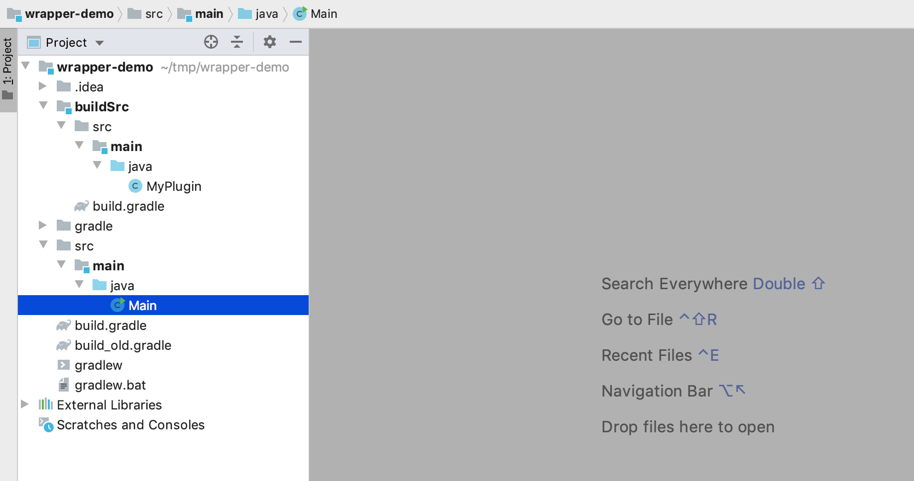

# Gradle知识总结

### 1. 什么是Gradle

Gradle是一种项目构建工具，利用它就可以使得具有一定目录结构的项目在它的组织下利用编译器进行编译。

1.  如何安装Gradle

```java
brew install gradle
```

2. 安装完毕后，执行 

```linux
zfz:~ zhangfengzhou$ gradle -v // 查看对应的版本号

------------------------------------------------------------
Gradle 6.2.1
------------------------------------------------------------

Build time:   2020-02-24 20:24:10 UTC
Revision:     aacbcb7e587faa6a8e7851751a76183b6187b164

Kotlin:       1.3.61
Groovy:       2.5.8
Ant:          Apache Ant(TM) version 1.10.7 compiled on September 1 2019
JVM:          13.0.2 (Oracle Corporation 13.0.2+8)
OS:           Mac OS X 10.14.6 x86_64
```

###  2. Gradle 能干什么

Gradle 能干什么已经解释了，可以进行项目的构建 那么如何构建项目呢？如何构建一个Java项目呢？

1. 创建目录

```linux
zfz:tmp zhangfengzhou$ mkdir java-demo
```

2. 切到`wrapper-demo`目录下执行如下命令

```linux
zfz:tmp zhangfengzhou$ cd java-demo/
zfz:java-demo zhangfengzhou$ gradle init --type java-application
Starting a Gradle Daemon, 2 busy and 1 incompatible Daemons could not be reused, use --status for details

Select build script DSL:
  1: Groovy
  2: Kotlin
Enter selection (default: Groovy) [1..2] 

Select test framework:
  1: JUnit 4
  2: TestNG
  3: Spock
  4: JUnit Jupiter
Enter selection (default: JUnit 4) [1..4] 

Project name (default: java-demo): 
Source package (default: java.demo): com.lucky.demo

> Task :init
Get more help with your project: https://docs.gradle.org/6.2.1/userguide/tutorial_java_projects.html

BUILD SUCCESSFUL in 21s
```

3. 创建项目完成之后，我们查看项目结构

```linux  
zfz:java-demo zhangfengzhou$ tree .
.
├── build.gradle
├── gradle
│   └── wrapper
│       ├── gradle-wrapper.jar
│       └── gradle-wrapper.properties
├── gradlew
├── gradlew.bat
├── settings.gradle
└── src
    ├── main
    │   ├── java
    │   │   └── com
    │   │       └── lucky
    │   │           └── demo
    │   │               └── App.java
    │   └── resources
    └── test
        ├── java
        │   └── com
        │       └── lucky
        │           └── demo
        │               └── AppTest.java
        └── resources

15 directories, 8 files
```

查看 `src/main`下面的`App.java`代码

```linux
/*
 * This Java source file was generated by the Gradle 'init' task.
 */
package com.lucky.demo;

public class App {
    public String getGreeting() {
        return "Hello world.";
    }

    public static void main(String[] args) {
        System.out.println(new App().getGreeting());
    }
}
```

4. 查看完项目结构之后我们进行项目编译

```linux
zfz:java-demo zhangfengzhou$ ./gradlew build
BUILD SUCCESSFUL in 1s
```

5. 查看有哪些任务

```linux
zfz:java-demo zhangfengzhou$ ./gradlew tasks

> Task :tasks

------------------------------------------------------------
Tasks runnable from root project
------------------------------------------------------------

Application tasks
-----------------
run - Runs this project as a JVM application

Build tasks
-----------
assemble - Assembles the outputs of this project.
build - Assembles and tests this project.
buildDependents - Assembles and tests this project and all projects that depend on it.
buildNeeded - Assembles and tests this project and all projects it depends on.
classes - Assembles main classes.
clean - Deletes the build directory.
jar - Assembles a jar archive containing the main classes.
testClasses - Assembles test classes.

Build Setup tasks
-----------------
init - Initializes a new Gradle build.
wrapper - Generates Gradle wrapper files.

Distribution tasks
------------------
assembleDist - Assembles the main distributions
distTar - Bundles the project as a distribution.
distZip - Bundles the project as a distribution.
installDist - Installs the project as a distribution as-is.

Documentation tasks
-------------------
javadoc - Generates Javadoc API documentation for the main source code.

Help tasks
----------
buildEnvironment - Displays all buildscript dependencies declared in root project 'java-demo'.
components - Displays the components produced by root project 'java-demo'. [incubating]
dependencies - Displays all dependencies declared in root project 'java-demo'.
dependencyInsight - Displays the insight into a specific dependency in root project 'java-demo'.
dependentComponents - Displays the dependent components of components in root project 'java-demo'. [incubating]
help - Displays a help message.
model - Displays the configuration model of root project 'java-demo'. [incubating]
outgoingVariants - Displays the outgoing variants of root project 'java-demo'.
projects - Displays the sub-projects of root project 'java-demo'.
properties - Displays the properties of root project 'java-demo'.
tasks - Displays the tasks runnable from root project 'java-demo'.

Verification tasks
------------------
check - Runs all checks.
test - Runs the unit tests.

Rules
-----
Pattern: clean<TaskName>: Cleans the output files of a task.
Pattern: build<ConfigurationName>: Assembles the artifacts of a configuration.
Pattern: upload<ConfigurationName>: Assembles and uploads the artifacts belonging to a configuration.

To see all tasks and more detail, run gradlew tasks --all

To see more detail about a task, run gradlew help --task <task>

BUILD SUCCESSFUL in 616ms
1 actionable task: 1 executed
```

6. 执行编译任务 `./gradlew run`

```linux
zfz:java-demo zhangfengzhou$ ./gradlew run
> Task :run
Hello world.

BUILD SUCCESSFUL in 690ms
2 actionable tasks: 1 executed, 1 up-to-date
```

我们可以看出打印了 Hello world 就是执行了项目的代码

从上面就可以看出，gradle具备一些创建项目，编译项目，执行项目的功能

更多项目构建知识可以查看  [https://guides.gradle.org/building-java-applications/](https://guides.gradle.org/building-java-applications/)

### 3. Gradle的基本知识点

1. Gradle 使用的语言

Gradle 使用的是一个叫做groovy的语言，可以执行在JVM上，使用和学习Gradle的一大部分在学习Groovy语法上，我们从以下几个方面来学习



我们可以打开IntelliJ IDEA的Groovy Console 学习Groovy语法 如下



2. 基本语法

1. 输出语句

```kotlin 
println("Hello") // hello
```

2. 列表, 字典

```kotlin 
list = [1, 2, 3, 4]
list.forEach{
    println(it) // 1 2 3 4
}
map = ["name":"Jack"]
```

3. 类相关

```kotlin 
class Foo {
    int bar = 1000
    void printBar(){
        println(bar)
    }
}

new Foo(bar: 100).printBar()

def foo = new Foo()
foo.printBar() // 100 

def fooOne = new Foo(bar: 1100)
// 属性访问
fooOne['bar'] = 250
// 方法访问
fooOne.invokeMethod("printBar", null) // 250 
fooOne."printBar"() // 250
```

4. 常用API

```kotlin 
listOne = [1, 2, 3, 4, 5, 6]
listOne.stream().filter({it->it%2==0}).forEach{
    println(it) // 2 4 6
}

listTwo = []
for (int index=0; index< listOne.size(); index++){
     int data  = listOne[index]
     if (data%2==0){
         listTwo.add(listOne.get(index)) 
     }
}

listTwo.forEach{
    print(it) // 2 4 6
}
```

5. 闭包

```kotlin 
// 第一种写法
def closure = {
    param->return param+1
}
println(closure(2)) // 3

// 第二中写法
def closure2 = {
    it+1
}
println(closure2(2))// 3

// 注意 Closure 是关键字 
def static operator(int i, Closure c){
    return c(i)  
}
println(operator(1, {2*it})) // 2

listMap = []
def saveData(Map<String, String> data){
    listMap.add(data)
}

Map map = new HashMap<String, String>()
map.put("name", "Jack")
saveData(map)
saveData(["name":"Rose"])
saveData(["name":"Lily"])

println(listMap.size()) // 3

```

```kotlin 
// 构建函数一
plugins {
    id "com.diffplug.gradle.spoletes" version "3.13.0"
}

// 构建函数二
plugins({
    id "com.diffplug.gradle.spoletes" version "3.13.0"
})

// 构建函三
plugins({
    id("com.diffplug.gradle.spoletes").version("3.13.0")
})

//上面三个构建函数是等价的，如果函数的参数是一个闭包，那么就可以省略括号  

buildScripts{
    ext{
        
    }
}
buildScripts({
    ext{
        
    }
})
// 闭包作为第一个参数 上面两个函数是等价的
```

6. 任务

1. 我们可以利用gradle简单创建一个项目

```kotlin 
zfz:tmp zhangfengzhou$ mkdir wrapper-demo  // 在tmp目录下创建一个 wrapper-demo 的文件夹
zfz:tmp zhangfengzhou$ cd wrapper-demo/  // 切换到 wrappper-demo 文件夹下
zfz:wrapper-demo zhangfengzhou$ gradle wrapper // 创建一个基础的Gradle项目

Deprecated Gradle features were used in this build, making it incompatible with Gradle 7.0.
Use '--warning-mode all' to show the individual deprecation warnings.
See https://docs.gradle.org/6.2.1/userguide/command_line_interface.html#sec:command_line_warnings

BUILD SUCCESSFUL in 702ms
1 actionable task: 1 executed

zfz:wrapper-demo zhangfengzhou$ tree .  // 查看wrapper-demo目录结构
.
├── gradle
│   └── wrapper
│       ├── gradle-wrapper.jar  
│       └── gradle-wrapper.properties
├── gradlew
└── gradlew.bat

2 directories, 4 files
```

2. 在根目录下创建build.gradle文件 build.gradle 是项目构建的脚本 

```kotlin 
zfz:wrapper-demo zhangfengzhou$ touch build.gradle // 创建build.gradle文件
zfz:wrapper-demo zhangfengzhou$ tree . // 查看 wrapper-demo 的目录结构
.
├── build.gradle
├── gradle
│   └── wrapper
│       ├── gradle-wrapper.jar
│       └── gradle-wrapper.properties
├── gradlew
└── gradlew.bat

2 directories, 5 files
```

```kot
vi build.gradle 进入编辑 build.gradle 模式

1. 按键 I 进行插入 
2. println(“hello world”)
3. 按键 esc 进行退出 
4. 按键 :wq 保存退出
```

同步下 我们就会看到 输出了 hello world 

### 4. 认识项目和任务

1. Gradle 的生命周期 [相关网址](https://docs.gradle.org/current/userguide/build_lifecycle.html#output_of_gradle_test_testboth) 


gradle 的生命止周期是分为三个部分 初始化阶段 配置阶段 和 执行阶段 

整个执行顺序是在build.gradle文件中从上到下依次执行  初始化 阶段就是一些 打印 定义等执行

配置阶段就是任务的配置阶段 就是任务Task的闭包代码被执行  执行阶段就是 执行指定的某个任务  例如 `./gradlew HelloWorld` 就是执行定义的HelloWord任务

```kotlin 
// 闭包是配置操作 对HelloWorld 这个任务进行配置 叫做config
// task 闭包的this
// doLast 添加到task 任务执行的最后 但并不在配置阶段执行

task('HelloWorld', {
    println ('congfigure......') // 配置阶段执行打印
    doLast({
        println('Executing task')
    })
})

task('HelloWorld') {
    println('congfigure......') // 配置阶段执行打印
    doLast {
      println('Executing task')
    }
}

// 上面两个操作是等价的 都是定义了一个名字为HelloWorld的任务
```

Gradle 核心模型 是Project和Task 

Project中一切无主的方法都是定义在Project上的

```kotlin 
for (int i =0; i< 10; i++){
    task('task'+i){
        def captureI = i // 闭包 函数获取外围变量 就会出现问题
        doLast {
            println("Executing Task ${captureI}")
        }
    }
}
// 以上操作会产生10个任务Task
```

```kotlin 
// 钩子函数
// project 完成evaluate 之后执行的函数
// evaluate 是 在配置阶段configuring的过程中 build.gradle从上都下执行之后 再执行
afterEvaluate {
    println('after evaluate')
}
```

```kotlin 
task("first") {
    // configure 的时候执行
    println('configuring')
    doLast {
        // 这个任务真正被执行的时候 进行执行 configure 的时候不执行
        println("I'm first task")
    }
}

10.times { i->
    task('task'+i){
        if (i%2==0){
            dependsOn('first') // 任务配置阶段 名称为偶数的任务执行前必须先执行名称为first的任务
        }
        def captureI = i
        doLast {
            println("Executing Task ${captureI}")
        }
    }
}
```

2. Gradle 插件编写

1. 在build.gradle中编写插件

```kotlin
task("first") {
    // configure 的时候执行
    println('configuring')
    doLast {
        // 这个任务真正被执行的时候 进行执行 configure 的时候不执行
        println("I'm first task")
    }
}

// 定义了一个名称为MyAweSomePlugin的插件
// 这个插件创建了10个任务 
// 我们在使用的时候 其实还是按照任务的名称来执行任务
// 比如 ./gradlew task1
class MyAweSomePlugin implements Plugin<Project>{
    @Override
    void apply(Project project) {
        (0..10).each{ i->
            project.task('task'+i){
                if (i%2==0){
                    dependsOn('first')
                }
                def captureI = i
                doLast {
                    println("Executing Task ${captureI}")
                }
            }
        }
    }
}

//apply plugin: 'java'
//apply plugin: 'groovy'

// 当使用apply plugin 的时候 就是调用MyAweSomePlugin的apply方法
apply plugin: MyAweSomePlugin
// 这一句等价于上面一句
apply([plugin:MyAweSomePlugin]) 

// 如果参数是Map 则可以去掉方括号
// 不引起歧义的时候 可以去掉扩号
// 插件编写 一堆可复用的逻辑

// 当我们写好脚本之后 可以放到服务器上来使用
//apply plugin: 'http://myserver.com/my-script'

// binary plugin 
```

2. 在项目中编写插件 即在buildSrc 中创建插件
   1. 如何在项目中引用第三库

```kotlin 
// 在build.gradle文件中创建 

apply plugin:'java'

repositories {
    mavenCentral()
}

dependencies {
    compile group:'org.apache.commons', name:'commons-lang3', version:'3.9'
}

// 然后就可以在项目中使用第三方库的API
import org.apache.commons.lang3.StringUtils;
class Main {
    public static void main(String[] args) {
       StringUtils.isNoneBlank("");
    }
}
```

​        2. 如何在构建项目阶段引入第三方库 使用第三方API 注意：是Gradle构建阶段 

```kotlin 
// 如果需要在构建阶段需要第三方库的支持
// 则必须在buildscript 中进行一些配置
// 第一步： 创建 buildscript 
buildscript {
    repositories {
        mavenCentral()
    }

    dependencies {
        classpath group:'org.apache.commons', name:'commons-lang3', version:'3.9'
//      classpath group:'com.mycompany.myplugin',name: 'myplugin', version:'1.0.0'
    }
}
// 第二步：引入类
import org.apache.commons.lang3.StringUtils
// 第三步：在build.gradle中使用API
// import 之后就可可以正常使用了
if(StringUtils.isNoneBlank()){
    // Execute builds
}

```

​       3.  如何编写插件

```kotlin 
1. 步骤一 创建 buildSrc目录
zfz:wrapper-demo zhangfengzhou$ mkdir -p buildSrc/src/main/java
zfz:wrapper-demo zhangfengzhou$ vi buildSrc/build.gradle
在build.gradle文件中写入 
apply plugin:'java'

2. 步骤二 编写插件 
import org.gradle.api.Plugin;
import org.gradle.api.Project;
import javax.annotation.Nonnull;

public class MyPlugin implements Plugin<Project> {
    @Override
    public void apply(@Nonnull Project project) {
         for (int i =0; i< 10;i++){
              project.task("task" + i);
         }
    }
}

3. 步骤三 .在build.gradle中引入插件
apply plugin: MyPlugin
```



build.gradle文件内容

```kotlin 
import org.apache.commons.lang3.StringUtils

// 如果需要在构建阶段需要第三方库的支持
// 则必须在buildscript 中进行一些配置
buildscript {
    repositories {
        mavenCentral()
    }

    dependencies {
        classpath group:'org.apache.commons', name:'commons-lang3', version:'3.9'
//      classpath group:'com.mycompany.myplugin',name: 'myplugin', version:'1.0.0'
    }
}

// 通知gradle 我要找这个java插件 然后gradle就会去找这个java 插件  然后找到这个插件对应的插件类之后就会执行 apply 方法 进行相应的任务创建工作
apply plugin:'java'
// 如果想在构建脚本中使用第三方库，我们需要把对应的库放到classpath 中
// 外层发现buildSrc 会发现 存在插件 然后在build中生成.jar文件 然后 默认放到 buildScrip 中的classpath  
// 下面这句意思就是 查找MyPlugin 插件 然后实例化plugin类 然后再调用apply方法
apply plugin: MyPlugin

//当MyPlugin 成熟的时候 可以发布到网上 然后 在classpath 中加入就可以了
repositories {
    mavenCentral()
}

dependencies {
    compile group:'org.apache.commons', name:'commons-lang3', version:'3.9'
}

// import 之后就可可以正常使用了
//if(StringUtils.isNoneBlank()){
//    // Execute builds
//}

// buildSrc 是gradle的一个约定

```

build_old.gradle文件

```kotlin 
println("hello world")

// 闭包是配置操作 对HelloWorld 这个任务进行配置 叫做config
// task 闭包的this
// doLast 添加到task 任务执行的最后 单并不在configure 阶段执行


//task('HelloWorld',{
//    println ('congfigure......')
//    doLast({
//        println('Executing task')
//    })
//})`

// 和上面的等价
//task('HelloWorld') {
//    println('congfigure......')
//    把doLast 添加到task 执行任务列表的最后
//    doLast {
//        println('Executing task')
//    }
//}

// Gradle 和核心模型
// Gradle 项目和构建 是和
// Project 一切无主的方法都是定义在Project上的

// 闭包 函数获取外围变量 就会出现问题
//for (int i =0; i< 10; i++){
//    task('task'+i){
//        def captureI = i
//        doLast {
//            println("Executing Task ${captureI}")
//        }
//    }
//}

// 钩子函数
afterEvaluate {
    // project 完成evaluate 之后执行的函数
    // evaluate 是 在configuring的过程中 build.gradle从上都下执行之后 再执行
    println('after evaluate')
}

task("first") {
    // configure 的时候执行
    println('configuring')
    doLast {
        // 这个任务真正被执行的时候 进行执行 configure 的时候不执行
        println("I'm first task")
    }
}

//10.times { i->
//    task('task'+i){
//        if (i%2==0){
//            dependsOn('first')
//        }
//        def captureI = i
//        doLast {
//            println("Executing Task ${captureI}")
//        }
//    }
//}

class MyAweSomePlugin implements Plugin<Project>{
    @Override
    void apply(Project project) {
        (0..10).each{ i->
            project.task('task'+i){
                if (i%2==0){
                    dependsOn('first')
                }
                def captureI = i
                doLast {
                    println("Executing Task ${captureI}")
                }
            }
        }
    }
}


//apply plugin: 'java'
//apply plugin: 'groovy'

// 当使用apply plugin 的时候 就是调用MyAweSomePlugin的apply方法
apply plugin: MyAweSomePlugin
//apply([plugin:MyAweSomePlugin])
// 不引起奇异的时候 可以去掉口号
// 如果参数是Map 则可以去掉方括号
// 插件编写 一堆可复用的逻辑

// 当我们写好脚本之后 可以放到服务器上来使用
//apply plugin: 'http://myserver.com/my-script'
```

### 5. 学习网站地址

[Gradle在线学习地址](https://www.bilibili.com/video/av70568380?p=1)


